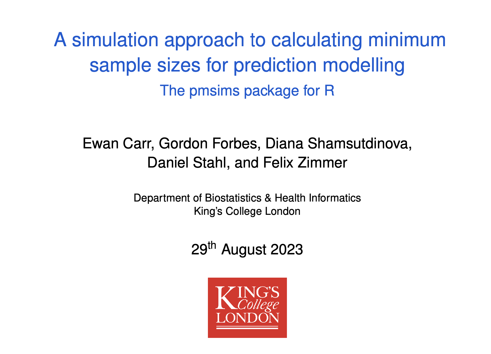

# A simulation approach to calculating minimum sample sizes for prediction modelling
*The pmsims package for R*

Ewan Carr, Gordon Forbes, Diana Shamsutdinova, Daniel Stahl, and Felix Zimmer

Presented at ISCB44, Milan, 29th August 2023.

